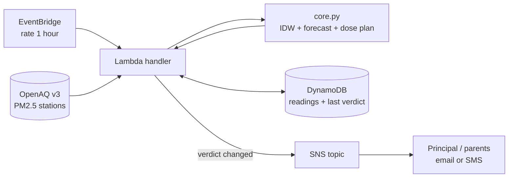

# Architecture

## Flow of one hourly run
1. EventBridge triggers the Lambda.
2. Latest PM2.5 for all stations in the bounding box is fetched; readings outside 0-1000 are dropped as sensor glitches.
3. For each school: IDW estimates PM2.5 at its exact coordinates; the reading is stored in DynamoDB.
4. The last 48 stored readings feed `forecast()` (persistence blended into a learned daily pattern).
5. `plan()` checks the scheduled PE slot against a dose budget and finds the cleanest hour today.
6. If the verdict differs from the last stored one (item `ts=0`), SNS publishes an alert.

## Design decisions
- **Pure `core.py`**: no AWS imports, so all logic is unit-tested locally.
- **Own history in DynamoDB**: forecasting needs no extra data API; it improves as the system runs (cold start falls back to persistence).
- **Alert on change only**: avoids repeated notifications.
- **Dose, not just AQI**: the same AQI is fine for a classroom and bad for PE; activity-specific minutes are more useful to a school.

## Known limits
- Breathing rates and the 37.5 ug/m3 reference budget are assumptions, easy to tune in `core.py`.
- `fetch_stations` is untested against the live OpenAQ API.
- Forecast is a simple statistical blend, not a trained model; it needs ~24 hourly points to learn the daily pattern.
